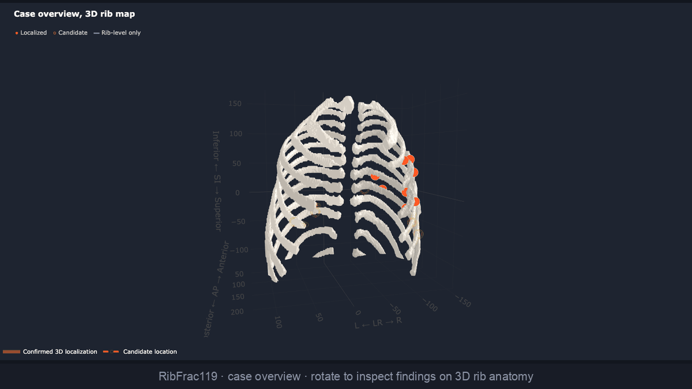
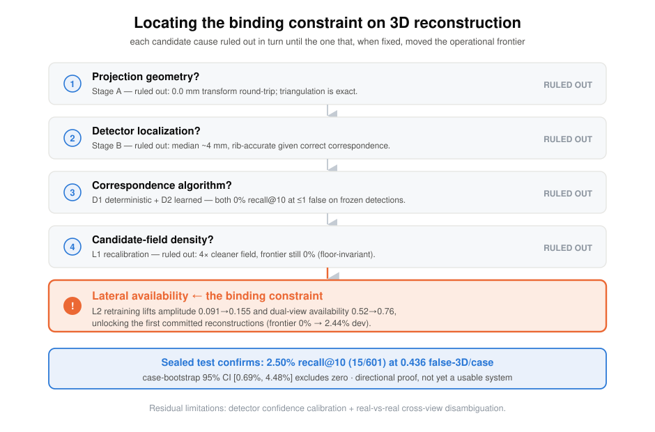
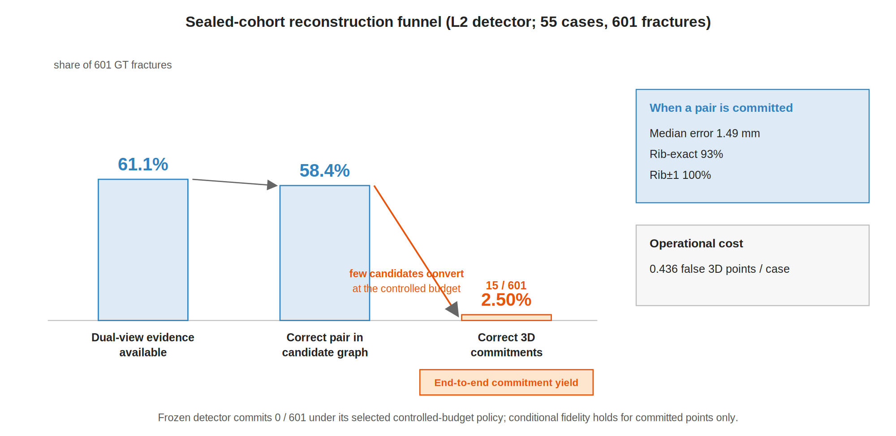
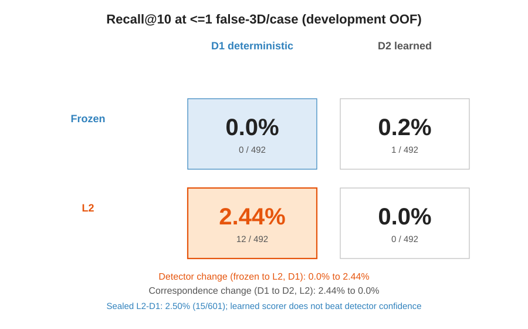
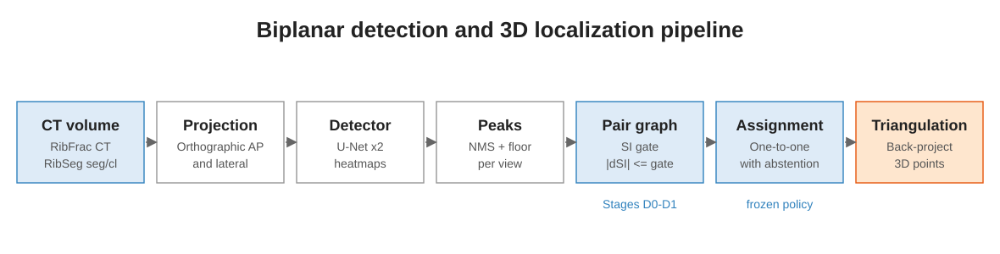
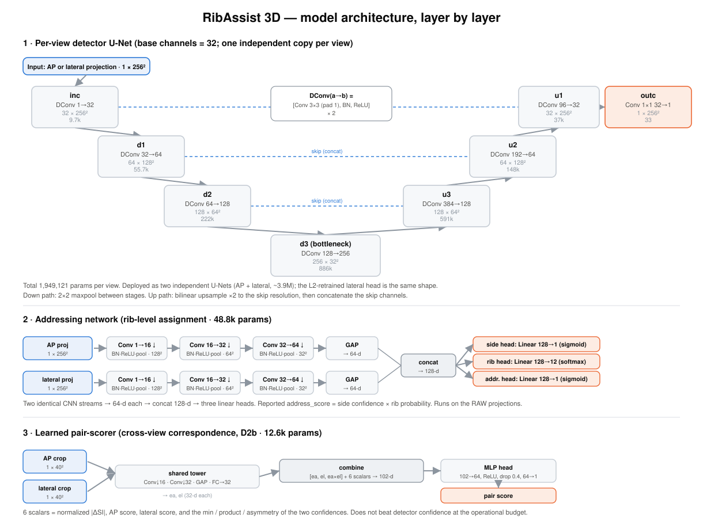

# RibAssist 3D

**Biplanar rib-fracture detection, anatomical addressing, and selective 3D localization.**

RibAssist 3D is a research proof-of-concept review-assistance system for highlighting suspected rib fractures in AP and lateral CT-derived projections, assigning predicted side and rib level, and selectively localizing sufficiently confident findings on interactive 3D rib anatomy. When cross-view correspondence is uncertain, the system abstains from producing a 3D point while preserving the original detection and available anatomical addressing for human review.



The project combines staged failure analysis, detector retraining, frozen-policy evaluation, and reproducibility checks.

> **Key results.** The biplanar geometry is exact, and given correct correspondence the localization is accurate (median **4.0 mm**, **88%** within 10 mm, **93.6%** rib-exact). On the sealed 55-case cohort a large share of fractures is recoverable (**61.1%** dual-view availability, **58.4%** candidate ceiling), and when the frozen policy commits a cross-view pair the 3D point is geometrically accurate (median **1.49 mm**, **93%** rib-exact). The evaluated reconstruction bottleneck is confidence-limited cross-view correspondence rather than geometry or conditional localization; rib addressing is a supporting workflow component that was not independently evaluated in this study. The terminal **end-to-end commitment yield is 2.50%** (15 of 601 fractures at 0.436 false 3D points per case; 95% CI 0.69%–4.48%), versus zero for the original detector under the same budget.
>
> This is a directional research proof of concept, not a diagnostic or deployable clinical system.

- **Demo video:** [YouTube](https://youtu.be/q-zNc-DKVEQ)
- **ORCID:** [0009-0008-6740-3214](https://orcid.org/0009-0008-6740-3214)


## Validated strengths

Read as a decomposition rather than a single number, the study establishes several strong results:

- **Exact geometry.** Orthographic back-projection and triangulation are exact (0.0 mm round-trip error).
- **Accurate conditional localization.** Given correct correspondence, detector-predicted centers reconstruct to median 4.0 mm, with 88% within 10 mm and 93.6% rib-exact.
- **Substantial candidate availability.** On the sealed cohort, 61.1% of fractures are dual-view available and 58.4% have a correct pair in the candidate graph.
- **High conditional fidelity when committed.** Committed sealed points have median 1.49 mm error and 93% rib-exactness at 0.436 false 3D points per case.
- **A reproducible bottleneck diagnosis.** Staged oracle-to-model swaps isolate confidence-limited cross-view correspondence as the effective operational bottleneck.
- **A clean attribution.** A 2×2 factorial attributes the operational gain to lateral-detector quality; the learned pair-scorer does not beat detector confidence at the operating budget.
- **A selective assistive workflow.** Detections and rib addressing persist for review even when 3D localization abstains.

The end-to-end commitment yield (2.50%) is the *terminal* metric of this funnel, not a measure of any single component.


## What this project shows

The central question: *can fractures detected independently in AP and lateral projections be paired across views and triangulated into reliable 3D points at a pre-specified controlled false-output budget?*

The staged program (A to L3) answers it by **identifying the effective operational bottleneck** under the tested detector and correspondence methods:



The initial failure arose from cross-view correspondence operating on weak lateral detections. Testing deterministic and learned local pair-scoring showed that neither moved the controlled-false-rate frontier on the frozen detector. This redirected the investigation toward lateral-detector quality, which turned out to be the effective lever.

**Main conclusion.** Geometry and detector localization were accurate when the correct cross-view observations were supplied. The operational failure occurred because the weak lateral detector produced low-confidence true observations within a noisy candidate graph. Candidate-field cleanup alone did not move the controlled-budget frontier; improving lateral-detector confidence did. Neither deterministic assignment nor learned local-appearance scoring produced meaningful controlled-budget recall on the frozen detections, whereas lateral retraining produced the first nonzero controlled-false-rate reconstructions, and the fixed-policy result transferred to the untouched sealed cohort.



The sealed result reads as a funnel: **61.1%** of fractures are dual-view available and **58.4%** have a correct pair in the candidate graph, but the controlled-budget assignment converts only **15 of 601** into correct 3D commitments. The large gap between candidate availability and committed yield *is* the finding, and it localizes the remaining problem to cross-view correspondence rather than to detection or geometry.

The 2×2 factorial attributes the observed gain to the **detector intervention** rather than to either of the tested correspondence methods: the learned appearance scorer does not beat detector confidence at the operational budget.



**Reading the reconstruction funnel.** This number is the *terminal* end-to-end commitment yield, i.e., the intersection of several selective gates (detection in both views, a correct pair in the candidate graph, survival of one-to-one assignment, confidence above the abstention threshold, and localization within tolerance). It is **not** geometry accuracy or conditional localization fidelity: a large share of fractures is recoverable (61.1% dual-view availability, 58.4% candidate ceiling), and committed points are geometrically accurate (median 1.49 mm, 93% rib-exact). Rib addressing is a supporting output whose standalone accuracy was not evaluated in this study. The low yield means RibAssist 3D is not yet a comprehensive or deployable reconstructor; the open problem is converting available candidates into confident cross-view commitments. When 3D correspondence abstains, the underlying detection and rib-addressing outputs remain available for review.

## Assistive use

RibAssist 3D is designed as a proof-of-concept assistive review system rather than a standalone diagnostic method.

Even when cross-view correspondence is too uncertain for 3D reconstruction, the system can still assist a reviewer by:

1. highlighting suspected fracture regions in the AP and lateral projections;
2. assigning a predicted side and rib level to organize findings anatomically;
3. preserving uncommitted detections for human review instead of discarding them;
4. selectively placing high-confidence findings on interactive 3D rib anatomy;
5. showing the projection evidence and 3D location together during per-finding review;
6. allowing the reviewer to accept, reject, or mark findings as needing further review.

The 3D layer is therefore **additive**. An abstention means the system declines to make an unreliable 3D localization claim; it does not remove the underlying fracture detection or rib-level information.

Model localization status and reviewer decisions are separate concepts in the review interface:

- **Localized:** the model committed a cross-view pair and emitted a 3D point.
- **Candidate:** a compatible pair exists, but confidence was insufficient to commit.
- **Rib-level only:** a detection and anatomical address remain available without a reliable 3D point.
- **Accepted / Needs review / Rejected:** human-review decisions recorded in the interface.

The current evidence supports RibAssist 3D as a workflow proof of concept for fracture highlighting, anatomical organization, and selective localization. It does not establish improved diagnostic accuracy, reduced reading time, or clinical benefit, because those outcomes would require a clinician reader study.

## Where it could fit clinically

RibAssist 3D is intended as a **secondary-review and anatomical-organization tool for chest-trauma CT**, not an autonomous diagnostic system. A potential user is a radiologist, emergency physician, trauma surgeon, or other clinician reviewing a patient with suspected thoracic injury.

**Potential workflow:** CT acquired → conventional CT review → RibAssist highlights suspected fractures and rib addresses, with selective 3D points → clinician confirms, rejects, or requests further review.

**Potential applications:**

- secondary fracture review, so subtle fractures are less likely to be overlooked;
- rib-level documentation (side, rib number, multifocal injuries) for more consistent reporting;
- structured injury summaries of trauma burden;
- prioritization for specialist review where coverage is limited;
- selective 3D orientation for high-confidence findings.

**Not yet established.** These applications are hypothetical: no clinician reader study, workflow study, or patient-outcome evaluation has been performed. The evidence supports that these functions exist and that committed 3D points are accurate, not that they improve sensitivity, reporting time, treatment decisions, or patient care.

## Clinician-Review Demo

**[Watch the workflow on YouTube](https://youtu.be/q-zNc-DKVEQ)** (screen recording; no checkpoints required to view).

The repository includes a Streamlit clinician-review app (`app.py`, `demo_app/`) that demonstrates the same assistive workflow interactively. **Checkpoints are not on GitHub.** Train locally ([`REPRODUCE.md`](REPRODUCE.md) Sections 5–11) and point the app at **your** artifacts under `outputs/`.

The demo expects artifacts at the paths in `demo_app/config.py`, including:

- `outputs/detector_dev_scratch_c32_both_gated/` (champion detector; Section 5)
- `outputs/addressing_model_ap_nopos/` (addressing model; Section 6)
- `outputs/detector_L2_lateral_hnm/` (L2 lateral detector; Section 9)
- `outputs/det_out_v2/det_test.npz` and `outputs/sealed/L2_sealed_D0_pairs.npz` (Section 11)
- RibFrac/RibSeg data under `data/` ([`DATA_SETUP.md`](DATA_SETUP.md))

After training and placing artifacts:

```bash
pip install -r requirements-demo.txt
python scripts/validate_local_artifacts.py --demo --strict
streamlit run app.py
```

The workflow covers case overview with interactive 3D rib anatomy, per-finding review with AP, lateral, and focused 3D evidence, and case summary with reviewer decisions. A detection is **never** removed because 3D correspondence abstains; it is retained for manual review.



## Repository layout

```
RibAssist-3D/
├── app.py                        # Streamlit clinician-review demo (entry point)
├── demo_app/                     # demo package (viewers, 3D scene, pipeline, UI)
├── scripts/                      # pipeline, evaluation, and figure scripts (see below)
├── figures/                      # architecture / bottleneck / results / attribution figures
├── tests/                        # unit tests
└── outputs/sealed/               # headline sealed-evaluation result JSONs (tracked)
```

**Not committed:** the `data/` datasets, model checkpoints, and large `.npz` / `.pt` tensors under `outputs/`;
these are prepared separately. Only the small headline sealed-evaluation JSONs in `outputs/sealed/` are tracked,
so the main-results figure regenerates from a fresh clone without any download.

**Key scripts** (`scripts/`): `train_detector.py`, `train_address.py`, `train_lateral_L2.py` (models);
`run_ribassist.py` (detection + addressing inference); `eval_biplanar_geometry*.py` (Stages A-C),
`eval_correspondence_D0/D1/D2*.py` (candidate graph, deterministic and learned correspondence),
`eval_lateral_L0*/L01*.py` (lateral diagnosis and calibration); `build_sealed_det_npz.py` and
`run_sealed_stage{1,2}*.sh` (sealed evaluation); `make_main_results_figure.py`, `make_schematic_figures.py`,
`make_demo_figures.py`.

## Quickstart

Requires Python 3.10+, PyTorch (Apple MPS or CUDA for training; CPU for evaluation), NumPy, SciPy, nibabel,
scikit-learn, and matplotlib. The demo additionally needs `requirements-demo.txt` (Streamlit, Plotly).

The datasets and model checkpoints are prepared separately and are **not** committed (they exceed Git limits and
include licensed derived data). The headline sealed-evaluation result JSONs **are** included under
`outputs/sealed/`, so the main-results figure regenerates directly from the repository with no download. To obtain
the datasets and reproduce the full pipeline, follow [`DATA_SETUP.md`](DATA_SETUP.md) (licensed data) and
[`REPRODUCE.md`](REPRODUCE.md) (end-to-end steps, hashes, and the sealed pass). The Streamlit demo is **not**
turnkey: train locally (Sections 5–11), then launch with `streamlit run app.py`.

## Method (one paragraph)

A CT volume is rendered to AP and lateral orthographic projections. A per-view U-Net emits a fracture heatmap;
peaks are extracted per view and paired into a candidate graph gated by shared-axis (SI) agreement. A one-to-one
**assignment with abstention** commits a correspondence only when the configured geometric and detector-confidence
cost clears the frozen abstention threshold, and each committed pair is back-projected and triangulated to a 3D point. A separate addressing model
predicts each detection's rib level. Detector, extraction policy, correspondence configuration, and evaluation are
frozen before the sealed test; all provenance is hash-checked and fails closed.

## Model architecture (layer by layer)

Three trained networks. The biplanar detector is **two independent single-channel U-Nets** (one per view);
cross-view "fusion" is a geometric candidate union on the shared superior-inferior (SI) axis, not a learned
layer, so there is no fusion network to describe. The addressing network and the learned pair-scorer are the two
auxiliary models.



### Per-view detector U-Net (base channels = 32)

Input is one 256×256 orthographic projection (single channel); output is a 256×256 fracture heatmap in [0, 1]
(sigmoid). Every `DoubleConv` is Conv 3×3 (pad 1), BatchNorm, ReLU, Conv 3×3 (pad 1), BatchNorm, ReLU.
Downsampling is 2×2 max-pool; upsampling is bilinear interpolation to the skip resolution followed by channel
concatenation.

| Stage | Operation | Output (C × H × W) | Params |
|---|---|---|---|
| Input | projection | 1 × 256 × 256 | 0 |
| `inc` | DoubleConv 1 -> 32 | 32 × 256 × 256 | 9,696 |
| `d1` | MaxPool, DoubleConv 32 -> 64 | 64 × 128 × 128 | 55,680 |
| `d2` | MaxPool, DoubleConv 64 -> 128 | 128 × 64 × 64 | 221,952 |
| `d3` (bottleneck) | MaxPool, DoubleConv 128 -> 256 | 256 × 32 × 32 | 886,272 |
| `u3` | Up + concat `d2`, DoubleConv 384 -> 128 | 128 × 64 × 64 | 590,592 |
| `u2` | Up + concat `d1`, DoubleConv 192 -> 64 | 64 × 128 × 128 | 147,840 |
| `u1` | Up + concat `inc`, DoubleConv 96 -> 32 | 32 × 256 × 256 | 37,056 |
| `outc` | Conv 1×1 32 -> 1, sigmoid | 1 × 256 × 256 | 33 |

Total: **1,949,121 parameters per view**. The deployed detector runs two independent copies (AP and lateral),
about 3.9M parameters combined. The L2 retrained lateral head has the identical shape (warm-started from the
champion lateral weights, BatchNorm, focal positive-branch weight 3.0, periodic hard-negative re-mining). A
training-only auxiliary rib-region head (a second 1×1 output conv on the shared decoder features) exists in some
checkpoints but is unused at inference; the deployed forward path returns only the fracture heatmap.

### Addressing network (rib-level assignment)

Two identical CNN streams (one per view), each 1 -> 16 -> 32 -> 64 channels over three [Conv 3×3 (pad 1),
BatchNorm, ReLU, MaxPool 2×2] blocks, then AdaptiveAvgPool to 1×1 and flatten to a 64-d embedding. The two
embeddings concatenate to 128-d and feed three linear heads. It runs on the RAW projections.

| Component | Operation | Output | Params |
|---|---|---|---|
| AP stream | 3x [Conv-BN-ReLU-MaxPool] 1 -> 16 -> 32 -> 64, AdaptiveAvgPool, Flatten | 64 | 23,520 |
| Lateral stream | same as AP stream | 64 | 23,520 |
| concat | [ap, lat] | 128 | 0 |
| side head | Linear 128 -> 1 (sigmoid) | 1 | 129 |
| rib head | Linear 128 -> 12 (softmax) | 12 | 1,548 |
| quality head | Linear 128 -> 1 (sigmoid) | 1 | 129 |

Total: **48,846 parameters**. The reported `address_score` is side confidence times rib probability. The auxiliary quality head is retained as implemented but is not the cross-view correspondence scorer (that is the separate learned pair-scorer below).

### Learned pair-scorer (correspondence, D2b)

Used only in the 2×2 attribution, to test whether learned local appearance beats detector confidence for
cross-view matching. A shared two-layer strided-conv tower embeds each 40×40 crop (AP and lateral) to 32-d; the
head scores the pair from [ap_emb, lat_emb, ap_emb × lat_emb] plus 6 geometric and confidence scalars
(normalized |dSI|, AP score, lateral score, and the min, product, and asymmetry of the two confidences).

| Component | Operation | Output | Params |
|---|---|---|---|
| crop (per view) | 40 × 40 patch | 1 × 40 × 40 | 0 |
| tower (shared) | Conv 3×3 s2 1 -> 16, BN, ReLU; Conv 3×3 s2 16 -> 32, BN, ReLU; AdaptiveAvgPool; Linear 32 -> 32 | 32 | 5,952 |
| head | Linear (32×3 + 6 = 102) -> 64, ReLU, Dropout 0.4, Linear 64 -> 1 | 1 | 6,657 |

Total: **12,609 parameters**. At the operational budget it does not beat detector confidence, which is why the
2×2 attributes the gain to the detector, not the correspondence method.

## Engineering and research areas

A compact map of the techniques this project exercises end to end:

- Medical-image computer vision
- Multi-view geometric reconstruction
- Detector calibration and hard-negative mining
- Assignment with abstention
- Case-level cross-validation and sealed evaluation
- Artifact provenance and reproducibility

## Status, limitations, and disclaimer

RibAssist 3D is a **research proof of concept**, not a medical device or clinical tool. It currently supports
fracture-region highlighting, rib-level addressing, and selective 3D localization for high-confidence cross-view
matches.

The sealed result remains limited: the end-to-end commitment yield was 2.5%, and only 6 of 55 cases produced at
least one correct reconstruction. The cohort was small, contained no validated negative-scan safety evaluation, and
used CT-derived simulated orthographic projections rather than independently acquired clinical radiographs.

Within the tested detector and local-correspondence methods, lateral-detector availability and confidence were the
effective lever. The next research directions are stronger lateral detection, global anatomical correspondence
using rib identity and ordering, evaluation on negative cases, and validation on more realistic or independently
acquired biplanar inputs.

**Do not use RibAssist 3D for diagnosis, treatment, or patient care.**

## Data

Datasets are third-party and governed by their own licenses and terms; they are **not** redistributed here:

- [RibFrac dataset](https://ribfrac.grand-challenge.org/)
- [RibSeg v2](https://github.com/M3DV/RibSeg)

## Cross-links

| Resource | Link |
|----------|------|
| **Source code (this repo)** | [`kabJhai/RibAssist-3D`](https://github.com/kabJhai/RibAssist-3D) |
| **Demo video** | [YouTube](https://youtu.be/q-zNc-DKVEQ) |

## License

- Original source code: [Apache License 2.0](LICENSE)
- Original documentation and figures: [CC BY 4.0](LICENSE-DOCS)
- Third-party datasets: governed by their original licenses and not redistributed

## Citation

If you use RibAssist 3D, please cite this repository together with the RibFrac and RibSeg datasets:

```bibtex
@misc{soboka2026ribassist,
  title        = {RibAssist 3D: Biplanar Rib-Fracture Detection, Addressing, and Selective 3D Localization from CT-Derived Projections},
  author       = {Soboka, Kabila Haile},
  year         = {2026},
  howpublished = {Research proof of concept},
  url          = {https://github.com/kabJhai/RibAssist-3D}
}
```